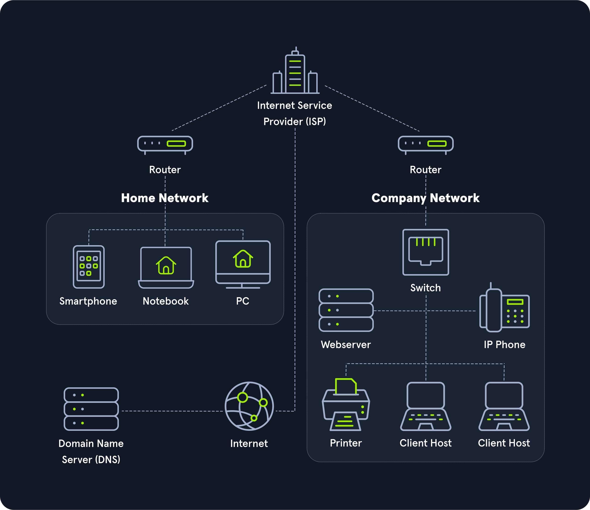

# NETPRACTICE
- [Intro](#intro)
- [Host](#host)
- [IP Address](#ip-address)
- [Network](#network)
- [Network Types](#network-types)
- [Book Terms](#book-terms)
- [Networking Topologies](#networking-topologies)
- [TCP/IP](#tcpip)
- [Subnetting](#subnetting)
- [NAT](#nat)
- [OSI Model](#osi-model)
- [DNS](#dns)
- [DHCP](#dhcp)
- [Routing and Switching](#routing-and-switching)
- [Firewalls](#firewalls)
- [Network Security](#network-security)
- [Wireless Networking](#wireless-networking)
- [Cloud Networking](#cloud-networking)
- [Network Troubleshooting](#network-troubleshooting)

---

## Intro
1. **What is a Network?**
   - A network consists of two or more computers that are linked to share resources (e.g., files, printers, and internet connections).
   - Networks enable communication and data exchange between devices.

2. **What is Networking?**
   - Networking, or computer networking, is the process of connecting two or more computing devices to share data and resources.
   - It involves hardware (e.g., routers, switches) and software (e.g., protocols, applications).

---

## Host
1. **Host**:
   - A host is any device that sends or receives traffic. Examples include TVs, phones, laptops, servers, and IoT devices.

2. **Types of Hosts**:
   - **Client**: A device that sends requests (e.g., a laptop accessing a website).
   - **Server**: A device that responds to requests (e.g., a web server hosting a website).

   A **Server** is essentially a computer that provides services to other devices (clients) on the network.

---

## IP Address
Every host has an identity, which is its **IP Address**.

1. **IP Address**:
   - An IP Address is a unique identifier assigned to each device on a network.
   - It allows devices to locate and communicate with each other.

2. **Structure of an IP Address**:
   - An IP Address is 32 bits long, divided into 4 octets (1 octet = 8 bits).
   - Example: `192.168.1.1`

   |  Octet  |  Octet  |  Octet  |  Octet  |
   | -------- | -------- | -------- | -------- |
   |   $\color{red}192.$ | $\color{red}168.$ | $\color{red}1.$ | $\color{yellow}1$ |

   - $\color{red}Network Portion$: Identifies the network.
   - $\color{yellow}Host Portion$: Identifies the specific device.

3. **Reserved IP Addresses**:
   - **Network Address**: The first IP of the network (e.g., `192.168.1.0`).
   - **Broadcast Address**: The last IP of the network (e.g., `192.168.1.255`).

4. **Usable IP Range**:
   - `192.168.1.1` - `192.168.1.254`

---

## Network
1. **Network**:
   - A network enables two or more computers to communicate with each other.
   - Networks can be small (e.g., home networks) or large (e.g., the internet).

   

---

## Network Types
| Network Type	                       | Definition                                 |
| -------------------------------------| ------------------------------------------ |
| Wide Area Network (WAN)	           | Internet                                   |
| Local Area Network (LAN)	           | Internal Networks (Ex: Home or Office)     |
| Wireless Local Area Network (WLAN)   | Internal Networks accessible over Wi-Fi    |
| Personal Area Network (PAN)          | Like Bluetooth (PTP Network)               |
| Virtual Private Network (VPN)	       | Connects multiple network sites to one LAN |

1. **WAN**:
   - **Wide Area Network** is commonly referred to as **the Internet**.
   - A WAN is a large number of LANs joined together.

2. **LAN and WLAN**:
   - **LAN** or **Local Area Network** and **WLAN** or **Wireless Local Area Network** typically assign IP Addresses designated for local use (RFC 1918, 10.0.0.0/8, 172.16.0.0/12, 192.168.0.0/16).

3. **VPN**:
   - **Virtual Private Networks** make the user feel as if they were plugged into a different network.

   **Types of VPN**:
   1. **Site-to-site VPN**: Both the client and server are devices (routers, firewalls).
   2. **Remote access VPN**: The client computer creates a virtual interface that behaves as if it's on a client's network.
   3. **SSL VPN**: VPN done in a web browser.

---

## Book Terms
| Network Type	                        | Definition                        |
| ------------------------------------- | --------------------------------- |
| Global Area Network (GAN)	            |   Global network (the Internet)   |
| Metropolitan Area Network (MAN)	    |   Regional network (multiple LANs)|
| Wireless Personal Area Network (WPAN)	|   Personal network (Bluetooth)    |

---

## Networking Topologies
A network topology is a typical arrangement and physical or logical connection of devices in a network.

1. **Common Topologies**:
   - **Star Topology**: All devices are connected to a central hub or switch.
   - **Bus Topology**: All devices are connected to a single communication line.
   - **Ring Topology**: Devices are connected in a circular fashion.
   - **Mesh Topology**: Devices are interconnected, providing multiple paths for data.

2. **Connections**:

| Wired Connections        | 	Wireless Connections   |
| ------------------------ | ------------------------- |
| Coaxial cabling	       |         Wi-Fi             |
| Glass fiber cabling	   |         Cellular          |
| Twisted-pair cabling	   |         Satellite         |
| and others	           |         and others        |

---

## TCP/IP
TCP/IP is a set of rules on how data should be sent and received accurately between devices.

1. **TCP/IP Protocols (Layers)**:

| Layer 4 | Application | End-user software (web browser)           |
| ------- | ----------- | ----------------------------------------- |
| Layer 3 | Transport   | TCP, UDP, ...                             |
| Layer 2 | Internet    | IP addressing and routing                 |
| Layer 1 | Physical    | Physical transmission of data (eth cables)|

---

## Subnetting
**Subnetting** is the process of creating a subnetwork (also known as a subnet) within a network.

1. **Example**:
   - Network address: `192.168.1.0`
   - Subnet: `192.168.1.0/24`
   - Subnet Mask: `255.255.255.0`

2. **Binary Representation**:
   - Subnet Mask in binary: `11111111.11111111.11111111.00000000`
   - Zeros indicate how many host addresses are available.

3. **Network Class Ranges**:
   - **Class A**: 1.0.0.0 - 126.255.255.255
   - **Class B**: 128.0.0.0 - 191.255.0.0
   - **Class C**: 192.0.0.0 - 223.255.255.0
   - **Class D**: 224.0.0.0 - 239.255.255.255
   - **Class E**: 240.0.0.0 - 255.255.255.255

---

## NAT
**NAT (Network Address Translation)**:
- Most home routers use NAT to allow multiple devices to connect to the internet using a single public IP address.
- NAT translates private IP addresses within a local network to a public IP address for communication over the internet.

---

## OSI Model
The **OSI (Open Systems Interconnection)** model is a conceptual framework used to understand and implement standard protocols in network communications.

1. **OSI Model Layers**:

| Layer 7 | Application | Provides network services directly to end-user applications (e.g., HTTP, FTP) |
| ------- | ----------- | ------------------------------------------------------------------------------ |
| Layer 6 | Presentation | Translates data between the application layer and the network format (e.g., encryption) |
| Layer 5 | Session     | Manages sessions between applications (e.g., establishing, managing, and terminating connections) |
| Layer 4 | Transport   | Ensures data transfer reliability (e.g., TCP, UDP)                             |
| Layer 3 | Network     | Handles routing and forwarding of data packets (e.g., IP)                      |
| Layer 2 | Data Link   | Provides node-to-node data transfer (e.g., Ethernet, MAC addresses)            |
| Layer 1 | Physical    | Transmits raw bit streams over a physical medium (e.g., cables, switches)      |

---

## DNS
**DNS (Domain Name System)**:
- DNS translates human-readable domain names (e.g., www.example.com) into IP addresses that computers use to identify each other on the network.
- DNS operates on the Application Layer (Layer 7) of the OSI model.

---

## DHCP
**DHCP (Dynamic Host Configuration Protocol)**:
- DHCP automatically assigns IP addresses and other network configuration parameters (e.g., subnet mask, default gateway) to devices on a network.
- DHCP operates on the Application Layer (Layer 7) of the OSI model.

---

## Routing and Switching
1. **Routing**:
   - Routing is the process of forwarding data packets between networks.
   - Routers use routing tables to determine the best path for data.

2. **Switching**:
   - Switching is the process of forwarding data packets within a network.
   - Switches use MAC addresses to direct data to the correct device.

---

## Firewalls
1. **Firewalls**:
   - Firewalls are security devices that monitor and control incoming and outgoing network traffic.
   - They act as a barrier between trusted and untrusted networks.

---

## Network Security
1. **Network Security**:
   - Network security involves protecting a network from unauthorized access, misuse, or attacks.
   - Common security measures include firewalls, encryption, and VPNs.

---

## Wireless Networking
1. **Wireless Networking**:
   - Wireless networks use radio waves to connect devices without cables.
   - Common wireless standards include Wi-Fi (IEEE 802.11) and Bluetooth.

---

## Cloud Networking
1. **Cloud Networking**:
   - Cloud networking involves using cloud-based services to manage and optimize network resources.
   - Examples include AWS, Azure, and Google Cloud.

---

## Network Troubleshooting
1. **Network Troubleshooting**:
   - Network troubleshooting involves identifying and resolving network issues.
   - Common tools include ping, traceroute, and network analyzers.

---
